# ComicReaderApp_MVI_Coroutine_RxKotlin
<!-- ALL-CONTRIBUTORS-BADGE:START - Do not remove or modify this section -->
[](#contributors-)
<!-- ALL-CONTRIBUTORS-BADGE:END -->
Comic reader app 📘. Learning MVVM / MVI with RxKotlin, Retrofit, Kotlin Coroutines

[](https://github.com/hoc081098/ComicReaderApp_MVI_Coroutine_RxKotlin_Jetpack/actions/workflows/build.yml)
[](https://github.com/hoc081098/ComicReaderApp_MVI_Coroutine_RxKotlin_Jetpack/actions/workflows/build-release.yml)
[](https://github.com/hoc081098/ComicReaderApp_MVI_Coroutine_RxKotlin_Jetpack/actions/workflows/spotless.yml)
[](https://github.com/hoc081098/ComicReaderApp_MVI_Coroutine_RxKotlin_Jetpack/actions/workflows/gradle-wrapper-validation.yml)
[](https://hits.seeyoufarm.com)

## Observable 🌀 + Flow 🌊 + suspend function ⚡ = 💗💎❤️

# Project features 🚀
This project brings to the table set of best practices, tools, and solutions:

-   100% [Kotlin](https://kotlinlang.org/)
-   Kotlin Coroutines with Flow
-   Functional & Reactive programming with [RxKotlin](https://github.com/ReactiveX/RxKotlin), [RxJava3](https://github.com/ReactiveX/RxJava)
-   Clean Architecture with MVI (Uni-directional data flow)
-   [Λrrow - Functional companion to Kotlin's Standard Library](https://arrow-kt.io/)
       - [Either](https://arrow-kt.io/docs/apidocs/arrow-core/arrow.core/-either/)
       - [Monad Comprehensions](https://arrow-kt.io/docs/patterns/monad_comprehensions/)
       - [Option](https://arrow-kt.io/docs/apidocs/arrow-core/arrow.core/-option/)
       - [parZip](https://arrow-kt.io/docs/apidocs/arrow-fx-coroutines/arrow.fx.coroutines/par-zip.html)
-   Modern architecture (Clean Architecture, Model-View-ViewModel)
-   Navigation, single-activity architecture with [Jetpack Navigation](https://developer.android.com/guide/navigation)
-   Initialize components at application startup with [AndroidX Startup](https://developer.android.com/topic/libraries/app-startup)
-   Cache local data with [Room Persistence Library](https://developer.android.com/topic/libraries/architecture/room)
-   Schedule tasks with [WorkManager](https://developer.android.com/topic/libraries/architecture/workmanager)
-   ViewModel, LiveData, Lifecycle, ... with [Android Jetpack](https://developer.android.com/jetpack)
-   Dependency injection [Koin](https://insert-koin.io/)
-   Material Design [Material Components for Android](https://github.com/material-components/material-components-android)
-   Kotlin Gradle DSL
-   Firebase: Firestore, Authentication, Storage, Analytics, Crashlytics
-   Gradle Kotlin DSL, Custom plugin

## Download APK

- [Download latest debug APK here](https://nightly.link/hoc081098/ComicReaderApp_MVI_Coroutine_RxKotlin_Jetpack/workflows/build/master/app-debug.zip)
- [Download latest release APK here](https://nightly.link/hoc081098/ComicReaderApp_MVI_Coroutine_RxKotlin_Jetpack/actions/runs/1360316687/app-release.zip)

# Develop
- You must use **Android Studio Arctic Fox (2020.3.1)** (**note: Java 11 is now the minimum version required**)
- Clone: `git clone https://github.com/hoc081098/ComicReaderApp_MVI_Coroutine_RxKotlin.git`
- _Optional: **Delete `.idea` folder** if cannot open project_
- Open project by `Android Studio` and run as usual

# Screenshots

|                         |                         |                         |                         |
|        :---:            |          :---:          |        :---:            |          :---:          |
|  |  | 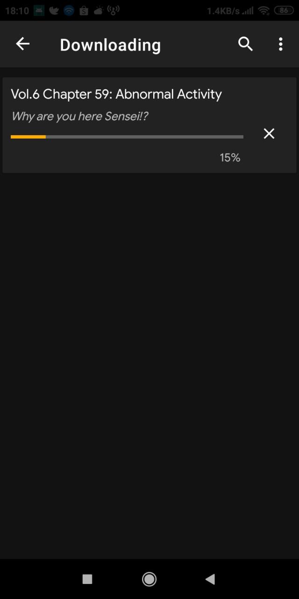 | 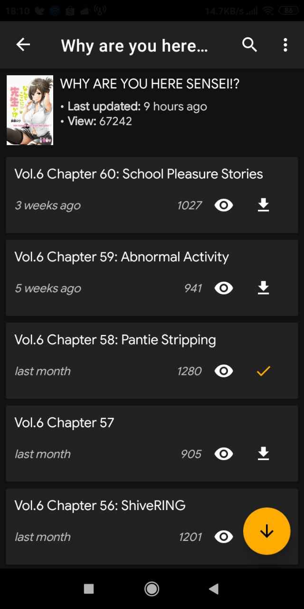 |
|  |  | 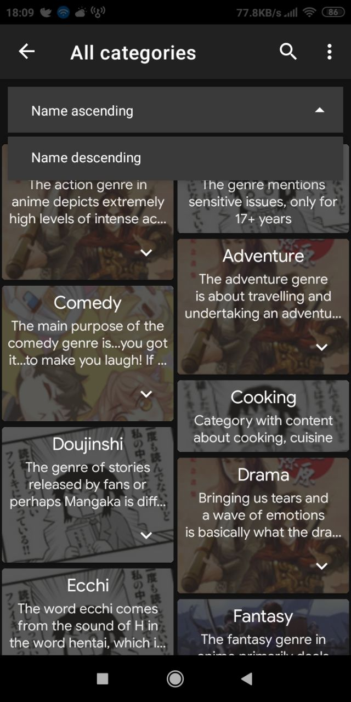 | 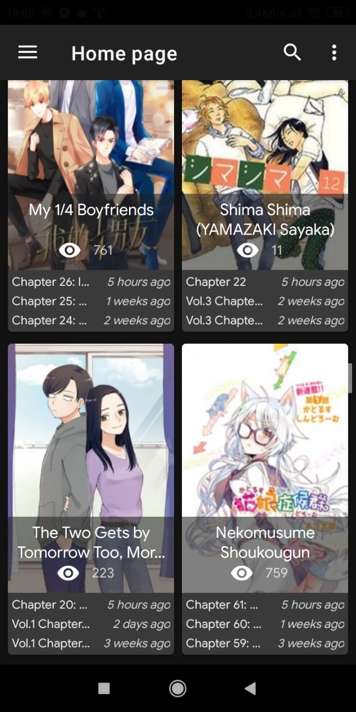 |
| 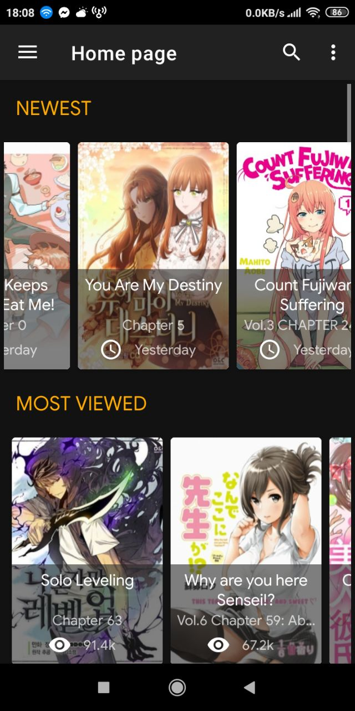 | 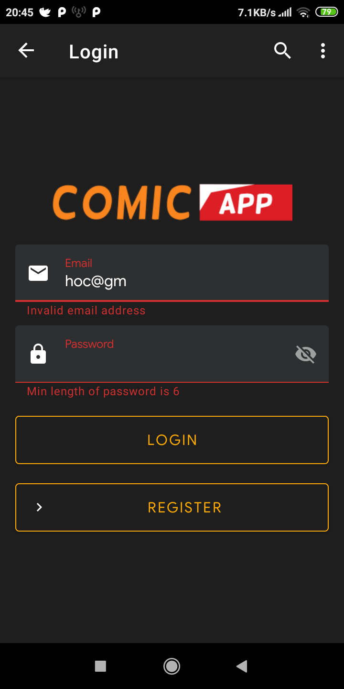 | 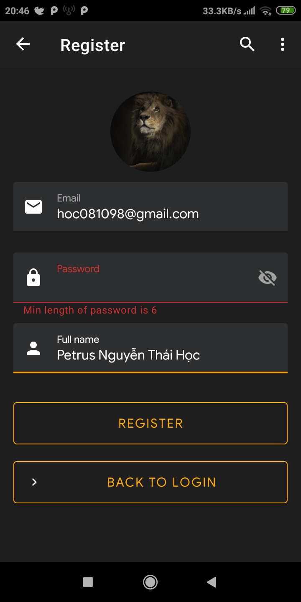 | 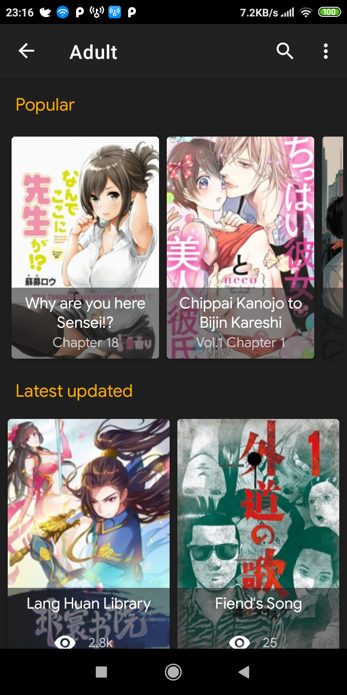 |
| 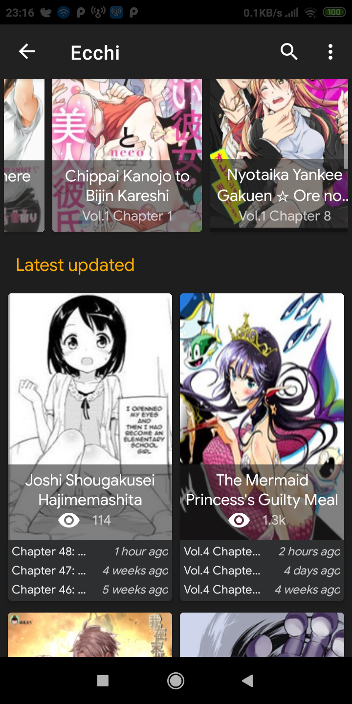 | 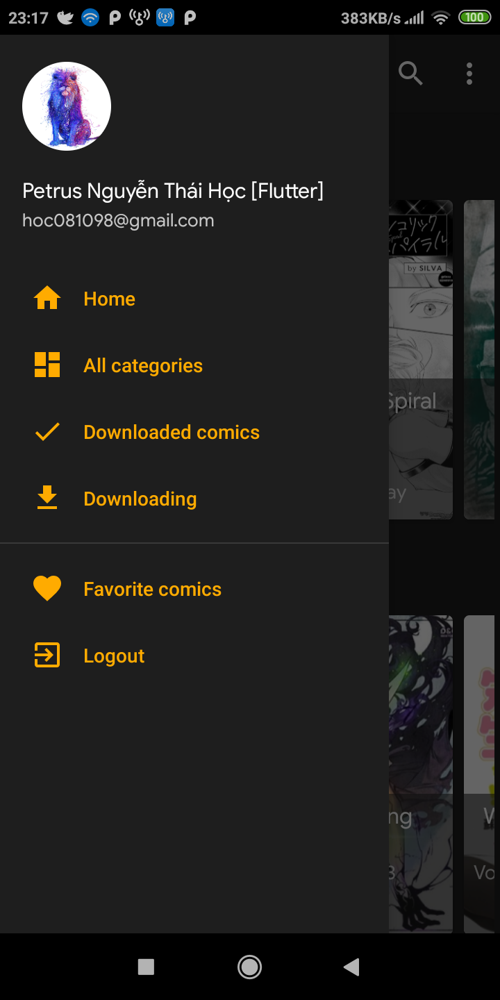 | 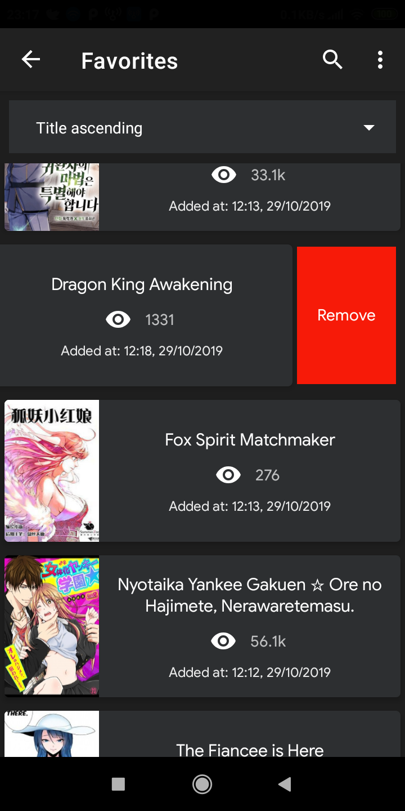 |                         |

# LOC

```sh
--------------------------------------------------------------------------------
 Language             Files        Lines        Blank      Comment         Code
--------------------------------------------------------------------------------
 Kotlin                 165        15406         1777          644        12985
 XML                     95         5181          464           81         4636
 Prolog                   7          127           18            0          109
 JSON                     2          103            0            0          103
 Markdown                 2          109           24            0           85
 Batch                    1           89           21            0           68
--------------------------------------------------------------------------------
 Total                  272        21015         2304          725        17986
--------------------------------------------------------------------------------
```

# Server and API

Clone this repository: https://github.com/hoc081098/comic_app_server_nodejs

# License

    MIT License

    Copyright (c) 2019-2021 Petrus Nguyễn Thái Học

## Contributors ✨

Thanks goes to these wonderful people ([emoji key](https://allcontributors.org/docs/en/emoji-key)):

<!-- ALL-CONTRIBUTORS-LIST:START - Do not remove or modify this section -->
<!-- prettier-ignore-start -->
<!-- markdownlint-disable -->
<table>
  <tr>
    <td align="center"><a href="https://www.linkedin.com/in/hoc081098/"><br /><sub><b>Petrus Nguyễn Thái Học</b></sub></a><br /><a href="https://github.com/hoc081098/ComicReaderApp_MVI_Coroutine_RxKotlin_Jetpack/commits?author=hoc081098" title="Code">💻</a> <a href="#maintenance-hoc081098" title="Maintenance">🚧</a> <a href="#ideas-hoc081098" title="Ideas, Planning, & Feedback">🤔</a> <a href="#design-hoc081098" title="Design">🎨</a> <a href="https://github.com/hoc081098/ComicReaderApp_MVI_Coroutine_RxKotlin_Jetpack/issues?q=author%3Ahoc081098" title="Bug reports">🐛</a></td>
  </tr>
</table>

<!-- markdownlint-restore -->
<!-- prettier-ignore-end -->

<!-- ALL-CONTRIBUTORS-LIST:END -->

This project follows the [all-contributors](https://github.com/all-contributors/all-contributors) specification. Contributions of any kind welcome!
